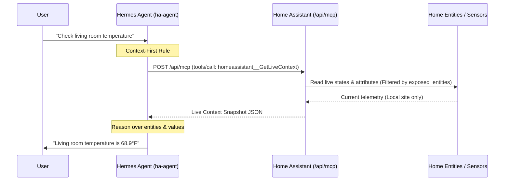
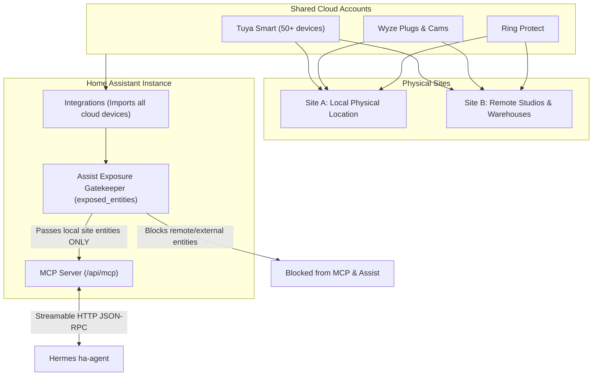

# Architecture & Protocol Specification

## Communication Sequence

## Multi-Location Isolation & Entity Filtering Architecture

## Protocol Details
- **Protocol**: Model Context Protocol (MCP) 2024-11-05 / 2025-06-18
- **Transport**: Streamable HTTP with JSON-RPC 2.0 payloads
- **Payload Headers**:
  - `Authorization: Bearer <TOKEN>`
  - `Content-Type: application/json`
  - `Accept: application/json`
